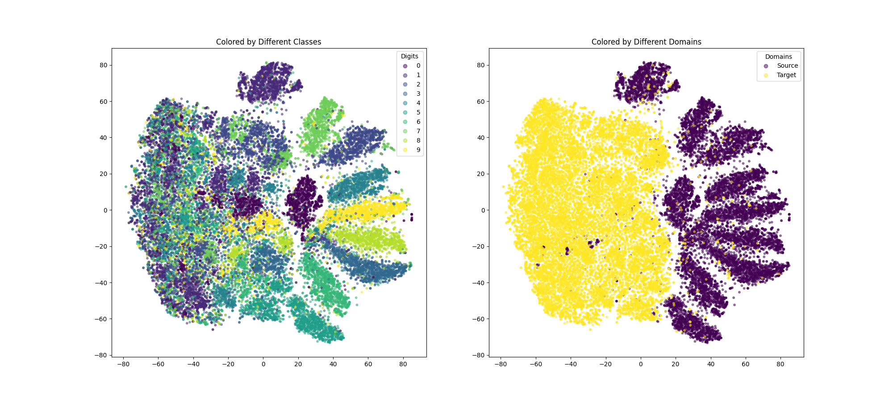
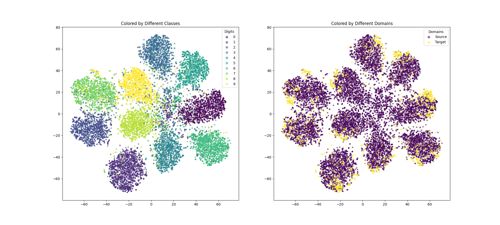

# Domain Adversarial Network

Domain adversarial network trained on MNIST-M, SVHN, and USPS

Source domain: MNIST-M

Target domain: SVHN and USPS

From MNIST-M to SVHN:

From MNIST-M to USPS:

See problem 3 in [Report.pdf](./Report.pdf) and [Spec.pdf](Spec.pdf)  more details.
